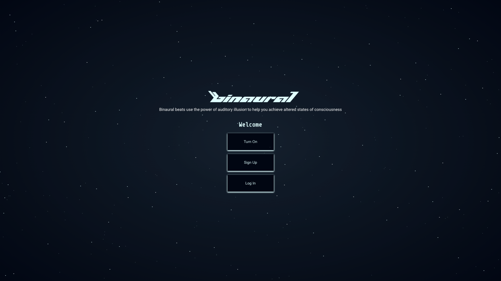
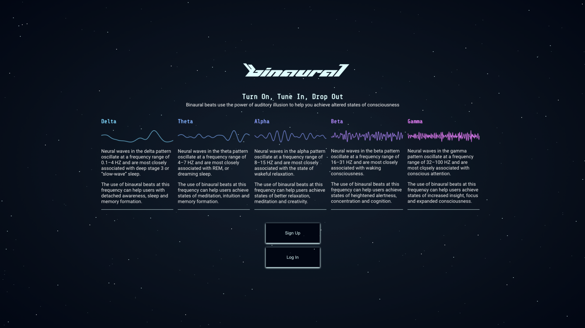
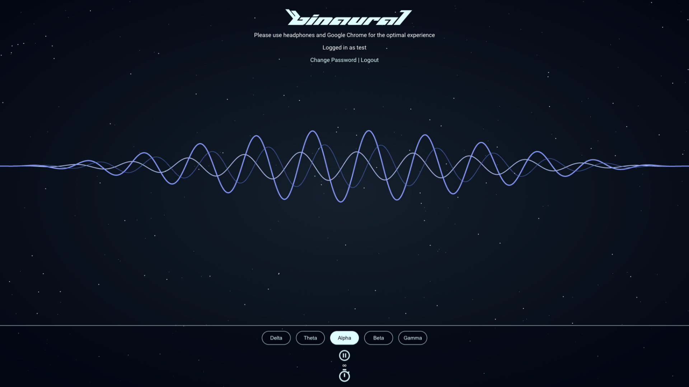

# Binaural

## Turn On, Tune In, Drop Out

Binaural generates binaural beats and audio visualizations to help users achieve altered states of consciousness.


## Screenshots

### Landing Screen



### Sign Up


### Binaural Beat Info



### Binaural Beat Visualizer



## Links

### Vercel
https://binaural-client.vercel.app/

### Heroku
https://intense-mesa-95345.herokuapp.com

### Client Repo
https://github.com/SeyiAriyo/binaural--client

### Server Repo
https://github.com/SeyiAriyo/binaural--server

## Technology

### Front-End
Front-End technology used for this project includes React, React Router, Web Audio API, Canvas, SineWave.js and Enzyme.

### Back-End
Back-End technology used for this project includes Express, Node, PostgreSQL, JWT, Winston, Mocha and Chai.

### Languages
Coding languages used for this project include Javascript, HTML and CSS.

### UX/UI
UX/UI designed in Adobe XD.

## Design Pattern

Binaural invokes a design pattern inspired by 1990s rave culture and electronic music. The typography is inspired by Icelandic musician <a href="https://www.youtube.com/watch?v=LsYVR1FO44A&list=RDLsYVR1FO44A&start_radio=1">Bjork</a>.

## Test Credentials

### Email
test@test.com

### Password
Testuser1!

API Endpoints:
--------------

### Users Endpoints
`/`
- Method: `GET`
- Request Params: nothing, but the user must be an administrator
    - returns a list of all the users in the database
- Response:
    -`200`
    ``` javascript
    {
            [
            {
                id: 1,
                email: 'test1@email.com',
                name: 'Test user 1',
                password: 'Password1!',
                admin: false,
            },
            {
                id: 2,
                email: 'test2@email.com',
                name: 'Test user 2',
                password: 'Password1!',
                admin: false,
            }, //...
        ];
    }
    ```
    - `400` if failed

- Method: `POST`
    - Request Params: 
        - Creates an account
        ``` javascript
        {
            email: 'test1@email.com',
            name: 'Test user 1',
            password: 'Password1!',
        }
        ```

    - Response:
        - `400` if failed
        - `201`
        - `/:id`

        
`/:id`

- Method: `GET`
    - Request Params: 
        - Returns a user by its id
        ``` javascript
        {
            id: 1,
        }
        ```

    - Response:
        - `200`
        
        ``` javascript 
        {
            email: 'test1@email.com',
            name: 'Test user 1',
            password: 'Password1!',
        }
        ```

        - `400` if failed


- Method: `PATCH`
    - Request Params: 
        - Update user password
        ``` javascript
        {
            id: 1,
            user_prefs: "newpassword",
        }
        ```

    - Response:
        - `204`
        - `409` if failed


- Method: `DELETE`
    - Request Params: 
        - Delets a user data
        ``` javascript
        {
            id: 1,
        }
        ```

    - Response:
        - `204`
        - `400` if failed


### Auth Endpoints

POST /api/auth/token
Logs in to an existing account

`/token`

- Method: `POST`
    - Request Params: 
        - Create user JWT 
        ``` javascript
        {
            email: 'test1@email.com',
            password: 'Password1!',
        }
        ```

    - Response:

        ``` javascript 

            jwtToken = "string"
        
        ```
        - `400` if failed

- Method: `PUT`
    - Request Params: 
        - Assigns user JWT 
        ``` javascript
        {
            id: 1,
            email: 'test1@email.com',
            name: test1,
        }
        ```

    - Response:

        ``` javascript 

            jwtToken = "string"
        
        ```


